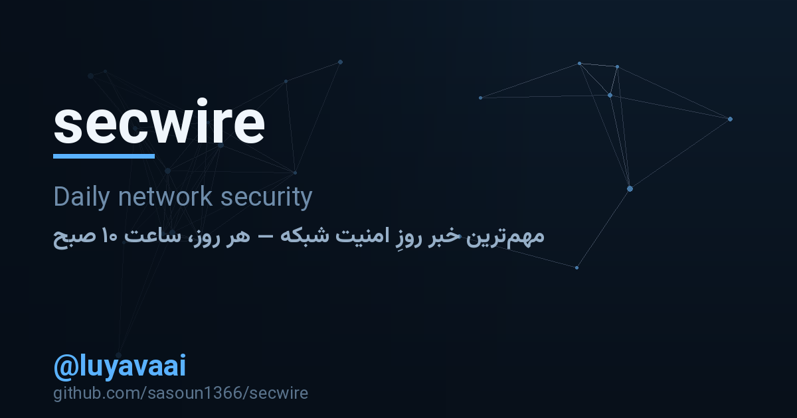

<div align="center">

# secwire

**One network-security story a day, in your Telegram channel — with the photograph,
in Persian and English, and an answer to "so what do we do about it?".**

[](https://github.com/sasoun1366/secwire/actions/workflows/test.yml)
[](https://github.com/sasoun1366/secwire/actions/workflows/daily.yml)
[](https://www.python.org/)
[](secwire)
[](LICENSE)
[](https://t.me/luyavaai)



</div>

Reads eight public security feeds, picks the story of the day, and posts it: a
photograph with a bilingual caption, then the Persian write-up, the English one, and
the other headlines in a line each. It runs on a schedule, needs no server, and no
API key. On a morning when nothing is new, it posts a hygiene tip rather than
nothing — the channel is never silent and never padded with press releases.

## What it looks like

```console
$ secwire sample
secwire 0.1.0 — offline sample (nothing is sent)
──────────────────────────────────────────────────────────────────────────────
story   : CISA Adds One Known Exploited Vulnerability to Catalog
desk    : CISA — known exploited vulnerabilities
category: vulnerability
photo   : yes
──────────────────────────────────────────────────────────────────────────────
#1 PHOTO + CAPTION [caption] — 408 characters  (limit 1024)
🛡 CISA یک آسیب‌پذیری شناخته شده مورد سوء استفاده را به کاتالوگ اضافه می‌کند

CISA بر اساس شواهدی مبنی بر بهره‌برداری فعال، یک آسیب‌پذیری جدید را به
کاتالوگ آسیب‌پذیری‌های شناخته‌شده (KEV) خود اضافه کرده است.

CISA Adds One Known Exploited Vulnerability to Catalog

🏷 آسیب‌پذیری و وصله · دوشنبه ۳۰ شهریور ۱۴۰۵
🌐 CISA — known exploited vulnerabilities

📡 کانال اخبار روزانهٔ امنیت شبکه: @luyavaai

#2 TEXT [fa] — 853 characters
🛡 CISA یک آسیب‌پذیری شناخته شده …
🏷 آسیب‌پذیری و وصله · دوشنبه ۳۰ شهریور ۱۴۰۵

CISA بر اساس شواهدی … CVE-2025-39682 …

🧰 چه کار کنیم
این دسته معمولاً با یک وصله بسته می‌شود. اگر آن سرویس روی لبهٔ شبکهٔ شماست،
امروز به‌روزرسانی‌اش کنید — نه آخر هفته.

🔗 ادامهٔ خبر — CISA — known exploited vulnerabilities
```

[`docs/preview.html`](docs/preview.html) is the same post rendered as the channel
would show it — open it in a browser.

## The schedule

`secwire schedule` says where to put it and what to write:

```console
$ secwire schedule
local time   : 10:00 (Tehran, offset +3:30)
github cron  : 30 6 * * * UTC   ← what .github/workflows/daily.yml uses
local cron   : 0 10 * * *    (crontab -e, machine time zone)
```

GitHub Actions is the recommended home for it: the schedule is free, the machine is
not yours, and every run is logged where you can read it. Four steps:

1. push this repository to GitHub
2. add two repository secrets — `SECWIRE_TELEGRAM_TOKEN` (from [@BotFather](https://t.me/BotFather))
   and `SECWIRE_CHAT_ID` (`@yourchannel`, or the `-100…` id)
3. make the bot an **administrator** of the channel
4. Actions → **daily post** → *Run workflow* — check it once by hand

The job commits `state/` back after every post, so the memory of what has already
been said survives the runner, and the translation cache means a headline is paid
for once.

## How it works

```
eight feeds ──▶ rank ──▶ the article's own page ──▶ Persian + English post ──▶ Telegram
                  │                │                        │
            freshness,        photograph and          free translation chain,
            relevance,        a longer lead           cached on disk
            desk weight
```

* **Ranking is explainable.** Freshness, how much the story is about defending
  something (CVE, patch, ransomware, router, VPN) rather than selling something
  (webinar, webinar, "unveils"), the desk that ran it, and a small bonus for having a
  picture. `secwire digest --explain` prints the arithmetic for every story.
* **One story, one post.** A story already posted, or the same story from another
  desk, is recognised by its identity and by headline overlap — the channel does not
  say the same thing twice in a week.
* **Nothing is invented.** The post is the story's own headline, its own opening
  lines, and a link. The only added text is the *what to do* line, which is standing
  advice for the category (patch it, close the port, rotate the password) and is
  written as advice, never as a claim about the reader's network.

## The desk

| key | source | weight | why it is here |
| --- | --- | --- | --- |
| `cisakev` | CISA known exploited vulnerabilities | 13 | the vulnerabilities being exploited right now |
| `krebs` | Krebs on Security | 12 | investigative reporting; breaking stories are the norm |
| `thn` | The Hacker News | 11 | fast, broad coverage of attacks and patches |
| `bleeping` | BleepingComputer | 11 | practitioner-focused, strong on ransomware |
| `record` | The Record | 10 | policy and state-linked intrusion reporting |
| `secweek` | SecurityWeek | 9 | enterprise vulnerabilities and industry moves |
| `darkread` | Dark Reading | 9 | defender-side analysis |
| `sansisc` | SANS ISC daily diary | 8 | what handlers are seeing in the wild today |

`secwire sources` lists them with their URLs. Adding one is a line in
`secwire/sources.py`; nothing else knows the difference.

**A source can refuse a runner's IP.** cisa.gov answers a GitHub runner with `403`
often enough to matter, so that source carries a second address: the KEV catalog is
mirrored on GitHub (`cisagov/kev-data`), which a runner can always reach, and the
JSON rows read as news because the date a row was added is the date that
vulnerability became exploited. A `403`, `429` or `5xx` also buys any source one more
ask a few seconds later. If a source is down for the day, the log says so and the
post still goes out — seven desks are enough for a morning.

## What a post contains

| # | message | what is in it |
| --- | --- | --- |
| 1 | photograph + caption | the Persian headline, one line of what happened, the English headline, category, Jalali and Gregorian date, the desk |
| 2 | Persian body | the lead, **چه کار کنیم** (what to do), the link |
| 3 | English body | the same, in English |
| 4 | today at a glance | up to three other headlines, one desk each, fa + en |

Every post is capped where Telegram caps it (1024 characters for a caption, 4096 for
a message) and cut on a line boundary, never mid-sentence.

## When things are not perfect

A daily channel lives or dies on its bad days, so each of them has an answer:

* **nothing new on the wire** → the tip of the day: 30 hygiene tips, Persian and
  English, picked by the date, each one something to do in thirty seconds
* **the article has no photograph** (advisories usually don't) → the bundled
  [`cover.png`](secwire/assets/cover.png) is uploaded instead, so the post still has
  a picture
* **the translation endpoints are down** → the Persian half carries the original
  headline and says the machine translation was unavailable; the English body is
  already complete
* **one feed is broken** → its second address is tried, the other seven are still
  read, and the failure is reported in the run log; one dead source never costs the
  day's post
* **Telegram refuses the photograph** → the caption goes as a message of its own
* **the run is rate-limited (429)** → it waits and tries again, three times

## Commands

| command | what it does |
| --- | --- |
| `secwire post` | choose today's story and publish it — this is the scheduled command |
| `secwire post --dry-run` | build it, print it, send nothing |
| `secwire digest --explain` | what is on the wire right now, ranked, with the reasons |
| `secwire sample` | the whole post, offline, from the bundled pages |
| `secwire preview --out docs/preview.html` | write the post as a page that looks like the channel |
| `secwire sources` | the desk |
| `secwire tip --list` | the fallback tips |
| `secwire doctor` | check the token, the channel, the feeds, the state |
| `secwire schedule` | the cron line, and how to install it |

Every command that reads the internet also takes `--offline`, which reads
`secwire/fixtures/` instead — the same code path, so what you see offline is what
goes out live.

## Configuration

| variable | default | meaning |
| --- | --- | --- |
| `SECWIRE_TELEGRAM_TOKEN` | — | the bot token (`TELEGRAM_BOT_TOKEN` also works) |
| `SECWIRE_CHAT_ID` | — | `@channel` or `-100…` (`TELEGRAM_CHAT_ID` also works) |
| `SECWIRE_HOME` | `~/.secwire` | where the memory (`seen.json`) and the translation cache live |
| `SECWIRE_TRANSLATE` | `1` | set to `0` for an English-only post |
| `SECWIRE_TRANSLATE_URL` | — | your own translation endpoint; any URL containing `{q}`, answering text, `{"translatedText": …}`, or the Google-shaped JSON |

Persian fonts and the cover card are in the repository; only redrawing the cover
needs Pillow (`pip install -e ".[cover]"` then `python3 tools/make_cover.py`).

## Development

```console
$ pip install -e ".[dev]"
$ pytest -q
$ secwire sample            # the post, from the bundled pages, with nothing sent
$ python3 tools/make_fixtures.py --dry-run    # how the bundle would be refreshed
```

When a source shows up as a complaint in the daily log, **Actions → feed probe → Run
workflow** asks that one feed from a runner with several header combinations and
prints the status codes — evidence for the fix, rather than a guess about which
header a CDN disliked this morning.

The tests never touch the network: `secwire/fixtures/` holds a frozen copy of the
wire (four items from each feed, the article behind the day's story, and the Persian
lines the sample needs). `tools/make_fixtures.py` is how that copy is made, so a test
that fails is a code failure, not a bad morning at a newsroom.

## Honest limits

* The free translation endpoints are unofficial and occasionally refuse a request
  from a busy IP; the post degrades to English rather than waiting, and
  `SECWIRE_TRANSLATE_URL` points the tool at your own service instead.
* GitHub's scheduler is best-effort — a busy morning can mean 06:37 UTC instead of
  06:30. The content does not change, only the minute.
* The photograph is the article's own picture, offered to Telegram by URL: secwire
  neither copies nor rehosts anybody's images.
* Feed summaries are what the publisher wrote; the tool tidies them (entities,
  boilerplate footers) but does not paraphrase them.

<!-- support:start -->
## Support the project

**secwire** is built and maintained in my own time. If it saved you an hour of
reading feeds every morning, you can help fund the next round:

**USDT (TRC20)**

```text
TMEyd1JZqdCjjKTc4zG2fhjzAYFKXCUWnA
```

For anything else, use the Telegram channel above. This wallet address is the only
one I publish for these projects.
<!-- support:end -->

## Stay updated

New releases are announced on Telegram: **[@luyavaai](https://t.me/luyavaai)** —
version notes, upgrade advice and practical network notes go there first. That
channel is also where this tool posts every morning at 10:00.

Credit: the interface font used in `assets/cover.png` is
[Vazirmatn](https://github.com/rastikerdar/vazirmatn) by Saber Rastikerdar, under the
SIL Open Font License (`secwire/assets/OFL.txt`).

## License

MIT — see [LICENSE](LICENSE).
